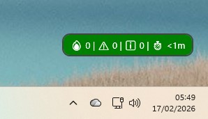
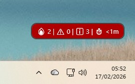
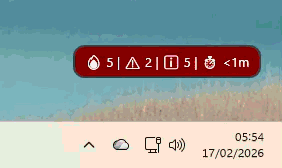
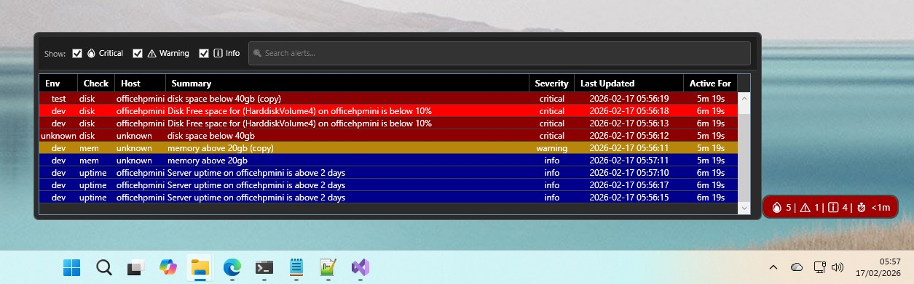

# GrafaMon (Graf-a-Mon) - Grafana Alert Monitoring Desktop Notifier

A lightweight WPF desktop application that displays real-time Grafana alert notifications with visual and audible alerts in a compact, always-on-top floating window. 

This application was inspired by [nagstamon](https://nagstamon.de/).

GrafaMon is released under the [GPLv3](https://www.gnu.org/licenses/gpl-3.0.html) license and is free to use and modify.

   [](https://github.com/simon-weston/GrafaMon/actions/workflows/release.yml)

---

## 🎯 Features

### **Visual Notifications**
- 🔥 **Summary Widget** - Always-on-top bubble showing alert counts (Critical, Warning, Info)
- ⚡ **Flashing Critical Alerts** - Animated red flashing when critical alerts are active
- 📊 **Detailed Alert Table** - Hover to see full alert details. Double-click to quickly jump to the alert details in Grafana. Severity filtering and search functionality
- 🎨 **Severity-Aware Highlighting** - Severity based row background colour (Critical=Red, Warning=Orange, Info=Blue)
- ⚠️ **Error Indicators** - Visual feedback when polling fails with error tooltips

### **Audio Notifications**
- 🔊 **Sound Alerts** - Plays sound when new critical alerts are detected
- 🎵 **Custom Sounds** - Support for custom `.wav` files or Windows system sounds
- 🔇 **Cooldown Protection** - 5-second debounce to prevent sound spam

### **Reliability & Performance**
- 🔄 **Auto-Retry** - Exponential backoff retry logic (0.5s → 1s → 2s)
- 📡 **Configurable Polling** - Adjustable polling interval (default: 60s)
- 🚀 **Optimized Performance** - Frozen brushes, efficient ObservableCollection updates
- 🛡️ **Robust Error Handling** - Graceful degradation, detailed logging

### **Developer-Friendly**
- 🏗️ **Clean Architecture** - Layered design (Domain, Application, Infrastructure, UI)
- 📝 **Comprehensive Logging** - Structured logging with Serilog
- ✅ **Unit Tested** - 170+ tests with 100% coverage for critical components
- 🔧 **Configurable** - JSON-based configuration with validation
- 🛡️ **Guard Class** - 19 validation methods for clean, consistent parameter validation

---

## 🛡️ Guard Validation Framework

GrafaMon includes a comprehensive **Guard class** that provides clean, reusable parameter validation throughout the codebase.

### **What is Guard?**

The Guard class reduces boilerplate validation code by **66%** while ensuring consistent error handling:

```csharp
// Before: 8 lines of validation
if (string.IsNullOrWhiteSpace(configPath))
{
    throw new ArgumentException("Config path cannot be null or empty", nameof(configPath));
}
if (!File.Exists(configPath))
{
    throw new FileNotFoundException($"Configuration file not found: {configPath}");
}

// After: 2 lines with Guard
Guard.AgainstNullOrWhiteSpace(configPath);
Guard.AgainstFileNotFound(configPath);
```

### **19 Guard Methods Available**

| Category | Methods | Use Cases |
|----------|---------|-----------|
| **Null & String** | `AgainstNull`, `AgainstNullOrWhiteSpace`, `AgainstNullOrEmpty`, `AgainstTooLong` | Constructor validation, API parameters |
| **Numeric** | `AgainstNegativeOrZero`, `AgainstNegative`, `AgainstLessThan`, `AgainstOutOfRange` | Configuration ranges, timeouts |
| **Network** | `AgainstInvalidPort`, `AgainstInvalidUrl`, `AgainstInvalidEmail` | API endpoints, email addresses |
| **File System** | `AgainstFileNotFound`, `AgainstDirectoryNotFound`, `AgainstInvalidPath`, `AgainstInvalidFileExtension` | File operations, sound files |
| **Collection** | `AgainstNullOrEmptyCollection` | Alert processing |
| **Other** | `AgainstUndefinedEnum`, `AgainstEmptyGuid`, `AgainstCondition` | Enum validation, correlation IDs |

### **Key Features**

✅ **Automatic Parameter Names** - Uses `CallerArgumentExpression` (no `nameof()` needed)  
✅ **Type-Safe** - Generic methods work with any `IComparable<T>`  
✅ **Composable** - Chain multiple validations  
✅ **Well-Tested** - 120+ unit tests with 100% coverage  
✅ **Zero Overhead** - 1-2 nanosecond performance impact  

### **Documentation**

- 📄 **[Cheat Sheet](./src/docs/GUARD_CHEAT_SHEET.md)** - Ultra-quick 1-page reference
- 📋 **[Quick Reference](./src/docs/GUARD_QUICK_REFERENCE.md)** - Common patterns and examples
- 📚 **[Usage Guide](./src/docs/GUARD_USAGE.md)** - Comprehensive guide with best practices
- 📖 **[API Reference](./src/docs/GUARD_API_REFERENCE.md)** - Complete API documentation

---

## 📸 Screenshots

### Summary Widget (Normal State)



### Summary Widget (Critical Alert - Flashing)



### Summary Widget (Critical Alert - Flashing - Animated)



### Detail Table (On Hover)



---

## 🚀 Quick Start

### **Prerequisites**
- Windows 10 version 1809 (build 17763) or later
- .NET 8.0 Desktop Runtime - [Download](https://dotnet.microsoft.com/download/dotnet/8.0/runtime)
- Grafana instance with Alertmanager API access
- Grafana API key with read permissions
- Grafana Alert Tags:
  - Severity
  - Environment
  - ServiceName (for alert - or uses Alert Name)

### **Installation via MSI Installer (Recommended)**

1. **Download the latest release**
   - Go to [Releases](https://github.com/simon-weston/GrafaMon/releases)
   - Download `GrafaMon-vX.X.X.msi`

2. **Install GrafaMon**
   - Double-click the MSI file
   - Default installation options:
     - Installation directory (default: `C:\Program Files\GrafaMon`)
     - Create desktop shortcut 
     - Auto-start on Windows login 
   - Click "Install" (requires administrator privileges)

3. **First Run Configuration**
   - Launch GrafaMon from Start Menu or Desktop shortcut
   - On first run, the Settings window will appear automatically
   - Configure your Grafana connection:
     - Grafana Base URL
     - API Key
     - Organization ID
     - Polling interval
   - Click "Test Connection" to verify settings
   - Click "Save"

4. **Configuration Location**
   - Config file: `%APPDATA%\GrafaMon\config.json`
   - Logs: `%APPDATA%\GrafaMon\logs\`

### **Silent Installation (Command Line)**

For automated deployments or enterprise installations:

```powershell
# Silent install with defaults
msiexec /i GrafaMon-vX.X.X.msi /quiet

# Silent install to custom directory
msiexec /i GrafaMon-vX.X.X.msi /quiet INSTALLDIR="C:\CustomPath\GrafaMon"

# Silent install without desktop shortcut
msiexec /i GrafaMon-vX.X.X.msi /quiet DESKTOPSHORTCUT=0

# Silent install without auto-start
msiexec /i GrafaMon-vX.X.X.msi /quiet AUTOSTARTAPP=0

# Silent uninstall
msiexec /x GrafaMon-vX.X.X.msi /quiet
```

### **Manual Installation (Advanced)**

If you prefer not to use the MSI installer:

1. Download the latest `GrafaMon.Wpf.exe` from [Releases](https://github.com/simon-weston/GrafaMon/releases)
2. Extract to a folder (e.g., `C:\Program Files\GrafaMon\`)
3. Ensure .NET 8.0 Desktop Runtime is installed
4. Run `GrafaMon.Wpf.exe`
5. Configure on first launch

---

## ⚙️ Configuration

Edit `config.json` in the application directory:

```json
{
  "GrafanaBaseUrl": "https://your-grafana-instance.local",
  "ApiKey": "your-grafana-api-key-here",
  "GrafanaOrgId": "1",
  "ActiveAlertsPath": "/api/alertmanager/grafana/api/v2/alerts",
  "PollingIntervalSeconds": 60,
  "EnableSoundNotifications": true,
  "SoundFilePath": ""
}
```

### **Configuration Options**

| Option | Required | Description | Default |
|--------|----------|-------------|---------|
| `GrafanaBaseUrl` | ✅ Yes | Base URL of your Grafana instance | - |
| `ApiKey` | ✅ Yes | Grafana API key (Service Account token) | - |
| `GrafanaOrgId` | ✅ Yes | Grafana organization ID | `"1"` |
| `ActiveAlertsPath` | ✅ Yes | API endpoint path for alerts | `/api/alertmanager/grafana/api/v2/alerts` |
| `PollingIntervalSeconds` | No | How often to poll Grafana (min: 5s) | `60` |
| `EnableSoundNotifications` | No | Enable/disable sound alerts | `true` |
| `SoundFilePath` | No | Path to custom `.wav` file (empty = system sound) | `""` |

### **Getting a Grafana API Key**

1. Go to **Grafana → Configuration → Service Accounts**
2. Click **Add service account**
3. Name: `AlertNotifications`
4. Role: **Viewer** (read-only access)
5. Click **Add service account token**
6. Copy the token and paste into `config.json` as `ApiKey`

---

## 🎨 UI Behavior

### **Summary Widget**
- **Always on top** - Stays visible above other windows
- **Draggable** - Click and drag to reposition
- **Auto-updates** - Refreshes every polling interval, clock symbol indicating polling up to date
- **Flashing** - Animates red when critical alerts are active
- **Error indicator** - Orange border + tooltip when polling fails

### **Detail Table**
- **Hover to show** - Appears when the mouse hovers over summary widget
- **Auto-hide** - Disappears when the mouse leaves after 5 seconds
- **Sortable** - Alerts sorted by severity (Critical → Warning → Info)
- **Color-coded rows** - Background colour matches severity
- **Hover highlighting** - Rows brighten on hover
- **Double-click** - Opens alert in Grafana (if `generatorURL` is available)

### **Alert Severity Colors**

| Severity | Summary Background | Detail Row | Hover Color |
|----------|-------------------|------------|-------------|
| Critical | Dark Red (`#8B0000`) | Dark Red (`#8B0000`) | Bright Red (`#FF0000`) |
| Warning | Dark Orange (`#B8860B`) | Dark Orange (`#B8860B`) | Bright Orange (`#FFA500`) |
| Info | Dark Blue (`#00008B`) | Dark Blue (`#00008B`) | Bright Blue (`#1E90FF`) |

---

## 🔊 Sound Notifications

### **When Sounds Play**
- A sound plays when a **new critical alert** is detected
- Sounds are **debounced** (5-second cooldown) to prevent spam

### **Custom Sound Files**
1. Place a `.wav` file anywhere on your system
2. Set `SoundFilePath` in `config.json` to the full path
3. Example: `"SoundFilePath": "C:\\Sounds\\critical-alert.wav"`

### **Fallback Behavior**
- If `SoundFilePath` is empty → Uses Windows system sound (`SystemSounds.Hand`)
- If custom file is missing → Falls back to system sound
- If custom file is not a `.wav` file → Falls back to system sound

---

## 🛠️ Troubleshooting

### **Widget doesn't appear**
- Check logs in `logs/` folder
- Verify `config.json` is valid JSON
- Ensure Grafana URL is accessible

### **No alerts showing (but Grafana has alerts)**
- Verify API key has correct permissions
- Check `GrafanaOrgId` matches your organization
- Verify `ActiveAlertsPath` is correct for your Grafana version
- Check logs for HTTP errors

### **Sound not playing**
- Verify `EnableSoundNotifications` is `true`
- Check sound file path is correct
- Ensure sound file is `.wav` format
- Check Windows volume settings

### **Widget flashing constantly**
- This means you have active critical alerts in Grafana
- Check Grafana Alerting page to resolve alerts

### **Polling errors (orange border)**
- Hover over widget to see error tooltip
- Check logs for detailed error messages
- Verify network connectivity to Grafana
- Verify API key is still valid

---

## 📊 Logging

Logs are written to `logs/` folder in the application directory.

### **Log Files**
- `log-YYYYMMDD.txt` - Daily rolling logs
- Logs are retained for 30 days

### **Log Levels**
- `Debug` - Detailed diagnostic information
- `Information` - General informational messages
- `Warning` - Non-critical issues (e.g., malformed alerts, sound errors)
- `Error` - Critical errors (e.g., HTTP failures, JSON parsing errors)

### **Example Log Entry**
```
2024-01-31 14:23:45.123 [INF] [Thread:1] [GrafanaAlertsReader] Fetching alerts from: https://grafana.example.local/api/alertmanager/grafana/api/v2/alerts
2024-01-31 14:23:45.456 [INF] [Thread:1] [GrafanaAlertsReader] Grafana API returned 200
2024-01-31 14:23:45.789 [DBG] [Thread:1] [GrafanaAlertsReader] Received 8 alerts from Grafana
```

---

## 🏗️ Architecture

### **Project Structure**
```
GrafaMon/
├── GrafaMon.Domain/       # Domain models (AlertDetail, AlertSeverity, etc.)
├── GrafaMon.Application/  # Business logic (Polling, Sound, Settings)
├── GrafaMon.Infrastructure/ # External integrations (HTTP, JSON)
├── GrafaMon.Wpf/          # WPF UI layer
└── GrafaMon.Tests/        # Unit tests
└── GrafaMon.Installer/    # WIX Installer
```

### **Key Design Patterns**
- **Clean Architecture** - Dependency inversion, separation of concerns
- **Dependency Injection** - Constructor injection with `Microsoft.Extensions.DependencyInjection`
- **Repository Pattern** - `IGrafanaAlertsReader` abstraction
- **MVVM** - `AlertWidgetViewModel` for UI binding
- **Event-Driven** - `CountsUpdated`, `DetailsUpdated`, `PollingError` events

---

## 🧪 Testing

### **Run Unit Tests**
```bash
dotnet test GrafaMon.Tests/GrafaMon.Tests.csproj
```

### **Test Coverage**
- **Guard Class** - 100% coverage (120 tests for all 19 validation methods)
- **AlertDtoMapper** - 100% coverage (18 tests)
- **SecureConfigurationManager** - 100% coverage (14 tests)
- **Total** - 170+ tests, all passing ✅

### **Test Categories**
- Parameter validation (Guard class)
- DTO mapping and transformation
- Encryption/decryption security
- Null handling and edge cases
- Date parsing and time zones

---

## 🤝 Contributing

Contributions are welcome! Please follow these guidelines:

1. **Fork the repository**
2. **Create a feature branch** (`git checkout -b feature/amazing-feature`)
3. **Write tests** for new functionality
4. **Ensure all tests pass** (`dotnet test`)
5. **Commit your changes** (`git commit -m 'Add amazing feature'`)
6. **Push to the branch** (`git push origin feature/amazing-feature`)
7. **Open a Pull Request**

---

## 📄 License and Why GPLv3

Copyright (C) 2026 Simon Weston

This project is licensed under the GPLv3 License - see the [LICENSE](LICENSE) file for details.

GPLv3 was chosen because I want this application to remain **free for everyone to use** while ensuring that **anyone who distributes a modified version also shares their changes**.

In short:

- You can freely use, run, and share the app.
- You can modify it for your own use.
- If you redistribute a modified version, you must also share the source under the same license.
- If you want to create a **closed-source version**, you must contact the author for a commercial license.


---

## 🙏 Acknowledgments

- **Grafana** - For the excellent alerting platform
- **Nagstamon** - Inspiration for this application
- **Serilog** - For structured logging
- **.NET Community** - For the amazing ecosystem

---

## 📞 Support

- **Issues** - [GitHub Issues](https://github.com/simon-weston/GrafaMon/issues)
- **Discussions** - [GitHub Discussions](https://github.com/simon-weston/GrafaMon/discussions)

---

## 🗺️ Roadmap

- [ ] Force refresh of alerts
- [ ] Window location - store on exit, move on start-up
- [ ] Multiple Grafana instance support
- [ ] Context menu in detail screen - quick links to HTTPS/RDP to host

---
